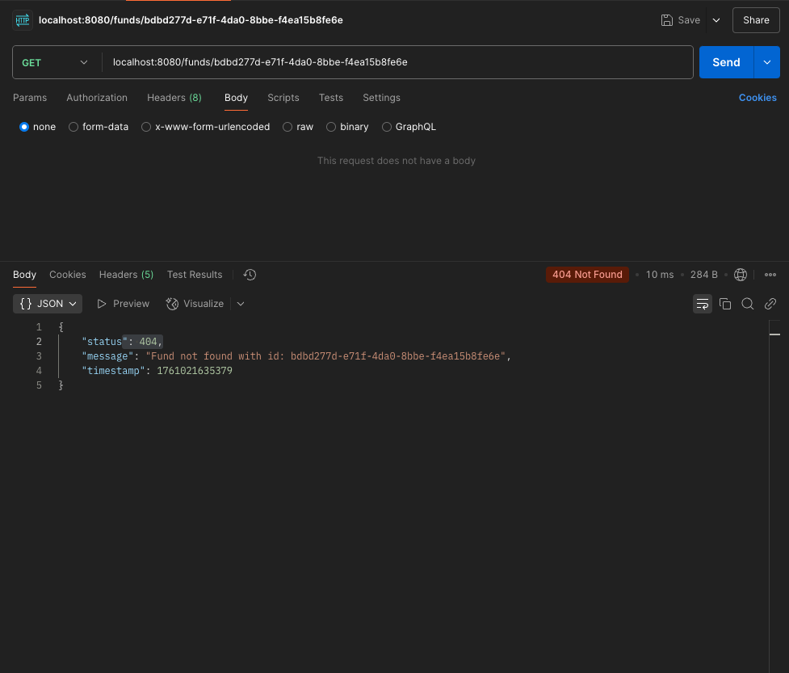
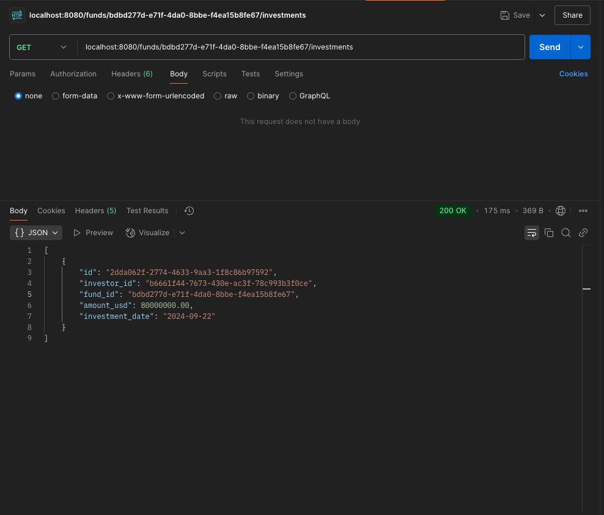

# Titanbay Private Markets API

RESTful API for managing private market funds, investors, and their investments\
A Spring Boot application for managing funds, investors, and investments.

---

## Table of Contents

- [Project Overview](#project-overview)
- [Technologies](#technologies)
- [Project Structure](#project-structure)
- [API Endpoints](#api-endpoints)
- [Setup and Run Instructions](#setup-and-run-instructions)
- [Run Instructions](#run-instructions)
- [Test Instructions](#test-instructions)
- [Screenshots](#screeshots)

---

## Project Overview

This application provides REST APIs to manage:

- **Funds**: Create, update, and retrieve funds.
- **Investors**: Add and retrieve investors.
- **Investments**: Record investments for funds.

---

## Technologies

- Java 17 (JDK)
- Spring Boot
- Maven
- PostgreSQL
- JUnit 5 + Mockito (for testing)
- Hibernate / JPA

---

## Project Structure
```
privatemarket/
├── src/
│ ├── main/
│ │ ├── java/com/titanbay/privatemarket/
│ │ │ ├── controller/
│ │ │ │ ├── FundController.java
│ │ │ │ ├── InvestorController.java
│ │ │ │ ├── InvestmentController.java
│ │ │ │ └── GlobalExceptionHandler
│ │ │ ├── service/
│ │ │ │ ├── FundService.java
│ │ │ │ ├── InvestorService.java
│ │ │ │ └── InvestmentService.java
│ │ │ │
│ │ │ ├── repository/
│ │ │ │ ├── FundRepository.java
│ │ │ │ ├── InvestorRepository.java
│ │ │ │ └── InvestmentRepository.java
│ │ │ │
│ │ │ ├── entity/
│ │ │ │ ├── Fund.java
│ │ │ │ ├── Investor.java
│ │ │ │ └── Investment.java
│ │ │ │
│ │ │ ├── dto/
│ │ │ │ ├── InvestmentRequestDto.java
│ │ │ │ ├── InvestmentResponseDto.java
│ │ │ │ └── ApiError
│ │ │ └── PrivateMarketApplication.java
│ │ │
│ │ └── resources/
│ │ ├── application.properties
│ │ └── schema.sql (For creating table)
│ │
│ └── test/java/com/titanbay/privatemarket/
│ ├── service/
│ │ ├── FundServiceTest.java
│ │ ├── InvestorServiceTest.java
│ │ └── InvestmentServiceTest.java
│ 
│ 
│
├── pom.xml
└── README.md
```
### Directory Overview

| **Folder / File** | **Description**                                                                                                                |
|--------------------|--------------------------------------------------------------------------------------------------------------------------------|
| `controller/` | Contains REST controllers that handle incoming HTTP requests and define API endpoints for funds, investors, and investments. Includes global error handling via a `GlobalExceptionHandler` for graceful handling of invalid requests and edge cases.  |
| `service/` | Implements the core business logic and orchestrates data between controllers and repositories.                                 |
| `repository/` | Interfaces extending Spring Data JPA repositories for database operations (CRUD).                                              |
| `entity/` | Contains JPA entity classes that map directly to database tables.                                                              |
| `dto/` | Data Transfer Objects used to transfer data between layers (e.g., request and response payloads).                              |
| `resources/` | Includes application configuration files like `application.properties` and optional SQL initialization scripts (`schema.sql`). |
| `test/` | Contains unit and integration tests for service and controller layers.                                                         |
| `pom.xml` | Maven build file that manages project dependencies, plugins, and build lifecycle.                                              |
| `PrivateMarketApplication.java` | Main entry point of the Spring Boot application — runs the embedded server.                                                    |
| `README.md` | Documentation file describing setup, usage, and project overview.                                                              |

---

## API Endpoints

### Fund Endpoints (`/funds`)

| **Method** | **Endpoint** | **Description** | **Request Body** | **Response** |
|-------------|--------------|------------------|------------------|---------------|
| `GET` | `/funds` | Retrieve all funds. | — | List of `Fund` objects |
| `GET` | `/funds/{id}` | Retrieve a specific fund by ID. | — | `Fund` |
| `POST` | `/funds` | Create a new fund. | `Fund` JSON | Created `Fund` |
| `PUT` | `/funds/{id}` | Update an existing fund by ID. | `Fund` JSON | Updated `Fund` |

---

### Investor Endpoints (`/investors`)

| **Method** | **Endpoint** | **Description** | **Request Body** | **Response** |
|-------------|--------------|------------------|------------------|---------------|
| `GET` | `/investors` | Retrieve all investors. | — | List of `Investor` objects |
| `POST` | `/investors` | Add a new investor. | `Investor` JSON | Created `Investor` |

---

### Investment Endpoints (`/funds/{fundId}/investments`)

| **Method** | **Endpoint** | **Description** | **Request Body** | **Response** |
|-------------|--------------|------------------|------------------|---------------|
| `POST` | `/funds/{fundId}/investments` | Create a new investment under a specific fund. | `Investment`JSON | Created `InvestmentResponseDto` |
| `GET` | `/funds/{fundId}/investments` | Retrieve all investments (optionally for a specific fund). | — | List of `Investment` objects |

---

## Setup and Run Instructions

### 1. Prerequisites

Ensure you have the following installed:

- Java 17
- Maven (3.6+)
- PostgreSQL (13+)
- Homebrew(optional)

---

### 2. Install Java 17

**macOS:**
1. **Install Homebrew (if not already installed)**\
   Open **Terminal** and run:
      ```bash
      /bin/bash -c "$(curl -fsSL https://raw.githubusercontent.com/Homebrew/install/HEAD/install.sh)"
      ```
2. Install java17
   
    ```bash
    brew install openjdk@17
    brew link --force --overwrite openjdk@17
    java -version
    ```
**Windows:**
1. **Download JDK 17**
    - Go to [Adoptium Temurin JDK 17 Downloads](https://adoptium.net/temurin/releases/?version=17).
    - Choose **Windows x64** and download the `.msi` installer.

2. **Run the Installer**
    - Double-click the downloaded `.msi` file.
    - Follow the installation wizard and note the installation path (default is usually `C:\Program Files\Eclipse Adoptium\jdk-17.0.x.x-hotspot`).

3. **Set JAVA_HOME Environment Variable**
    - Open **Start → Search "Environment Variables" → Edit the system environment variables → Environment Variables…**
    - Under **System variables**, click **New…**
        - Variable name: `JAVA_HOME`
        - Variable value: the JDK installation path (e.g., `C:\Program Files\Eclipse Adoptium\jdk-17.0.x.x-hotspot`)
    - Click **OK**.

4. **Update the PATH Variable**
    - In the same **Environment Variables** window, under **System variables**, find `Path` and click **Edit…**
    - Click **New** and add:
      ```text
      %JAVA_HOME%\bin
      ```  
    - Click **OK** to save.

5. **Verify Java Installation**
    - Open a new **Command Prompt** and run:

   ```cmd
   java -version
   ```
   You should see something like:
    ```
    java version "17.0.x" 2023-xx-xx LTS
    Java(TM) SE Runtime Environment (build 17.0.x+xx)
    Java HotSpot(TM) 64-Bit Server VM (build 17.0.x+xx, mixed mode, sharing)
   ```
   This confirms that Java 17 is installed and ready on Windows.

### 3. Install Apache Maven
#### macOS
1. **Install Maven using Homebrew**
      ```bash
      brew install maven
      ```
2. **Verify Installation**
    ```bash
   mvn -version
    ```
    You should see:
    ```
    Apache Maven 3.9.x
    Maven home: /opt/homebrew/Cellar/maven/3.9.x
    Java version: 17.0.x
    ```
#### Windows

1. **Download Maven**
    - Visit the [Apache Maven Downloads page](https://maven.apache.org/download.cgi).
    - Under *Files*, download the binary zip archive (e.g., `apache-maven-3.9.x-bin.zip`).

2. **Extract Maven**
    - Unzip the downloaded file to a folder, e.g.:
      ```
      C:\Program Files\Apache\Maven
      ```

3. **Set Environment Variables**
    - Open **Start → Search "Environment Variables" → Edit the system environment variables → Environment Variables…**
    - Under **System variables**, click **New…**
        - Variable name: `MAVEN_HOME`
        - Variable value: Maven installation path, e.g.:
          ```
          C:\Program Files\Apache\Maven\apache-maven-3.9.x
          ```
    - Click **OK**.

4. **Update the PATH Variable**
    - Under **System variables**, find `Path` → **Edit…**
    - Click **New** and add:
      ```
      %MAVEN_HOME%\bin
      ```
    - Click **OK** to save.

5. **Verify Maven Installation**
    - Open **Command Prompt** and run:
      ```cmd
      mvn -version
      ```
    - You should see output similar to:
      ```
      Apache Maven 3.9.x
      Maven home: C:\Program Files\Apache\Maven\apache-maven-3.9.x
      Java version: 17.0.x
      ```

---

### 4. Install PostgreSQL
#### macOS
1. **Install Maven using Homebrew**
      ```bash
      brew install postgresql
      ```
2. **Start the PostgreSQL Service**
    ```bash
    brew services start postgresql
    ```
3. **Verify Installation**
      ```bash
      psql -U postgres
      ```
#### Windows

1. **Download PostgreSQL**
    - Go to the official [PostgreSQL Downloads page](https://www.postgresql.org/download/windows/).
    - Click **"Download the installer"** to be redirected to the [EDB PostgreSQL Installer](https://www.enterprisedb.com/downloads/postgres-postgresql-downloads).

2. **Run the Installer**
    - Choose the appropriate version (e.g., PostgreSQL 16.x) and run the `.exe` file.
    - During setup:
        - **Installation Directory:**  
          Example:
          ```
          C:\Program Files\PostgreSQL\16
          ```
        - **Password:**  
          Set a password for the **postgres** superuser (remember this password — you’ll need it later).
        - **Port Number:**  
          Leave the default `5432` unless it’s already in use.
        - Continue and complete the installation.

3. **Verify Installation**
    - Open **Command Prompt** and run:
      ```cmd
      psql -U postgres
      ```
    - Enter the password you set during installation.
    - You should see the PostgreSQL shell prompt:
      ```
      postgres=#
      ```

4. **(Optional) Add PostgreSQL to PATH**
    - If `psql` isn’t recognized, add PostgreSQL’s `bin` folder to your PATH:
      ```
      C:\Program Files\PostgreSQL\16\bin
      ```

5. **Create a New Database**
   ```sql
   CREATE DATABASE mydb;
   \c mydb;

 ⚠️ **Important: Database Setup**  
 Before running the Spring Boot application, you must create the database used by the project.  
 Open your PostgreSQL terminal and run the following command:
 ```sql
 CREATE DATABASE private_fund OWNER <YOUR_USER_NAME>;
 ```
Replace **`YOUR_USER_NAME`** with your PostgreSQL username if it’s different on your system.\
To verify:
```
\c private_fund
```
You should connect to the database `private_fund`.

---

## Run Instructions

### 1. Clone this project to your local machine with git clone
```
git clone https://github.com/chenjk119/private-market.git
```

### 2. Start PostgreSQL
Make sure PostgreSQL is running locally and that the database `private_fund` has been created.

```sql
-- In PostgreSQL console
CREATE DATABASE private_fund OWNER <YOUR_USER_NAME>;
```
Replace **`YOUR_USER_NAME`** with your PostgreSQL username if it’s different on your system.

### 3. Configure `application.properties`

Before running the application, ensure `src/main/resources/application.properties` is configured correctly. Here’s an example:

```properties
# Spring Boot Application
spring.application.name=privatemarket
server.port=8080

# Database Connection
spring.datasource.url=jdbc:postgresql://localhost:5432/private_fund
spring.datasource.username=<YOUR_USER_NAME> # change it to your own username for postgresql
spring.datasource.password=   # leave blank if no password
spring.datasource.driver-class-name=org.postgresql.Driver

# Initialize Schema
spring.sql.init.mode=always
spring.sql.init.schema-locations=classpath:schema.sql

# JPA Settings
spring.jpa.hibernate.ddl-auto=none   # schema managed via schema.sql
spring.jpa.show-sql=true             # optional: logs SQL statements
```

### 4. Build the Project
From the root of the project directory
```
mvn clean install
```

### 5. Run the Application
```
mvn spring-boot:run
```
Once started, the application will be available at:\
`http://localhost:8080
`

### 6. Test the API
You can test endpoints using tools like:
- Postman
- curl
- Any web browser

Example
```
curl http://localhost:8080/funds
```

⚠️ **Important Notes**

- Ensure the schema.sql file exists under src/main/resources/ — it will be automatically executed at startup. It is responsible for creating the three tables: fund, investor, and investment.

- spring.jpa.hibernate.ddl-auto=none means schema creation is handled by schema.sql, not Hibernate.

- To modify the port or database connection, update application.properties.**

---

## Test Instructions
This project includes unit tests for the service layer.

### Running Tests
- To run all tests, use the following Maven command:
   ```
   mvn test
   ```

---

## Screeshots
Below are some screenshots demonstrating the application in action:

### Fund
- `GET` /funds

- `POST` /funds

- `PUT` /funds

- `GET` /funds/{id}

- Error handling



---

### Investors
- `GET` /investors

- `post` /investors


---

### Investments
- `GET` /funds/{fund_id}/investments

- `POST` /funds/{fund_id}/investments

- Error handling

